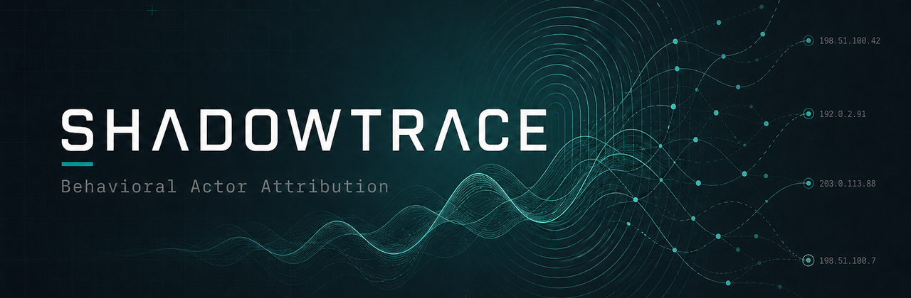

<p align="center">
  
</p>

<h1 align="center">SHADOWTRACE</h1>

<p align="center">
  <strong>Detect attackers by behavior — not by IP.</strong><br/>
  Real-time behavioral fingerprinting &amp; cross-IP actor attribution
</p>

<p align="center">
  <a href="https://github.com/yexploit/shadowtrace"></a>
  
  
  
</p>

---

**Real-time attacker behavioral fingerprinting** — detect operators by behavior, not IP.

SHADOWTRACE tails live logs, optionally sniffs traffic, accepts streamed events, continuously rebuilds behavioral fingerprints, and attributes activity across changing IPs, usernames, tools, and networks.

Works on **Windows and Linux**. Users can pick either interface:

| Interface | Start command |
|---|---|
| **CLI** | `python shadowtrace.py` / `python3 shadowtrace.py` |
| **GUI** | `python shadowtrace_gui.py` / `python3 shadowtrace_gui.py` |

Both talk to the same engine and SQLite database.

---

## Install

```bash
cd shadowtrace
python -m venv .venv

# Windows
.venv\Scripts\activate
# Linux
# source .venv/bin/activate

pip install -r requirements.txt
pip install -e .
```

Live packet capture needs Scapy (already in requirements) and **admin/root**.

---

## Choose CLI or GUI

### CLI

```bash
# Windows
python shadowtrace.py --help
python shadowtrace.py monitor -p C:\logs\auth.log
python shadowtrace.py ingest C:\logs\auth.log --kind ssh
python shadowtrace.py attribute
python shadowtrace.py compare 10.0.0.21 185.220.101.44
python shadowtrace.py status

# Linux
python3 shadowtrace.py --help
python3 shadowtrace.py monitor -p /var/log/auth.log
python3 shadowtrace.py ingest /var/log/auth.log --kind ssh
python3 shadowtrace.py attribute
```

### GUI

```bash
# Windows
python shadowtrace_gui.py

# Linux
python3 shadowtrace_gui.py

# optional bind
python3 shadowtrace_gui.py --host 0.0.0.0 --port 8787 --no-browser
```

Opens **http://127.0.0.1:8787/** (browser opens automatically unless `--no-browser`).

---

## Real-time usage

### 1) Follow production / lab logs

```bash
# Windows
python shadowtrace.py monitor -p C:\logs\auth.log -p C:\logs\access.log

# Linux
python3 shadowtrace.py monitor -p /var/log/auth.log -p /var/log/nginx/access.log

# CLI monitor + GUI together
python3 shadowtrace.py monitor -p /var/log/auth.log --serve
```

### 2) Live packet capture

```bash
# requires elevated privileges
python3 shadowtrace.py capture --iface eth0
# Windows: --iface "Ethernet" (or omit for default)
```

### 3) UDP event stream (agents / SIEM forwarders)

Send JSONL lines to UDP:

```bash
python3 shadowtrace.py monitor --udp-port 9514 --serve
```

Example event:

```json
{"ts":"2026-08-13T18:01:02Z","src_ip":"10.0.0.21","event_type":"ssh_fail","username":"root","dst_port":22,"protocol":"ssh"}
```

### 4) Push events over HTTP

```bash
curl -X POST http://127.0.0.1:8787/api/events -H "Content-Type: application/json" -d "{\"events\":[{\"src_ip\":\"10.0.0.21\",\"event_type\":\"ssh_fail\",\"username\":\"admin\",\"dst_port\":22,\"protocol\":\"ssh\"}]}"
```

GUI features once running:

- Start / stop live monitor
- Live event feed + WebSocket updates
- Fingerprints, clusters, similarity graph, SOC detections
- Upload historical logs / Zeek / PCAP

---

## Batch ingest (historical)

```bash
python3 shadowtrace.py ingest path/to/auth.log --kind ssh
python3 shadowtrace.py ingest path/to/zeek_dir --kind zeek
python3 shadowtrace.py ingest capture.pcap --kind pcap
python3 shadowtrace.py attribute
python3 shadowtrace.py compare 10.0.0.21 185.220.101.44
python3 shadowtrace.py detect
```

---

## What it fingerprints

| Signal | Meaning |
|---|---|
| Temporal signature | Scan / probe cadence consistency |
| Enumeration pattern | Sequential vs random port behavior |
| Protocol sequence | Mix + ordering of SSH / HTTP / DNS / scan |
| Username behavior | Diversity + entropy of attempted accounts |
| Burst / HTTP / DNS | Burstiness, ordered paths, DNS periodicity |

When two different source IPs share a high composite score, SHADOWTRACE links them as a **probable same operator**.

---

## Architecture

```
logs / PCAP / UDP / HTTP API
        │
        ▼
  RealtimeEngine  -- flush --> SQLite
        │
        ├─ continuous attribution (scikit-learn + similarity)
        ├─ NetworkX actor graph
        └─ WebSocket + FastAPI GUI / CLI status
```

## Project layout

```
shadowtrace/                 # project root
├── shadowtrace.py           # CLI starter
├── shadowtrace_gui.py       # GUI starter
├── assets/banner.png        # README banner
├── pyproject.toml
├── requirements.txt
├── README.md
├── data/                    # SQLite DB + uploads
├── tests/
└── src/
    └── shadowtrace/         # Python package (library code)
        ├── cli.py
        ├── gui_launcher.py
        ├── api/
        ├── realtime/
        ├── attribution/
        ├── features/
        ├── ingest/
        ├── detection/
        ├── db/
        └── gui/static/      # dashboard assets
```

---

## CLI map (`python3 shadowtrace.py <command>`)

| Command | Purpose |
|---|---|
| `monitor` | Real-time watch (logs / capture / UDP) |
| `watch` | Follow one log file |
| `capture` | Live packet capture |
| `serve` / `gui` | Same live dashboard as `shadowtrace_gui.py` |
| `ingest` | Historical batch load |
| `fingerprint` / `attribute` / `compare` | Analysis |
| `detect` | SOC detectors |
| `status` / `stats` | Engine + DB state |

---

## Configuration

Environment prefix `SHADOWTRACE_`:

| Variable | Default | Meaning |
|---|---|---|
| `DB_PATH` | `data/shadowtrace.db` | SQLite path |
| `ATTR_INTERVAL_SEC` | `5` | Seconds between live attribution passes |
| `FLUSH_BATCH` | `25` | Events before forced DB flush |
| `SAME_ACTOR_THRESHOLD` | `0.85` | Same-operator link cut |
| `API_HOST` / `API_PORT` | `127.0.0.1` / `8787` | GUI bind |
| `DEFAULT_BPF` | `tcp or udp` | Capture filter |

---

## Tests

```bash
pytest -q
```

---

## Ethics

Defensive SOC / research tooling for **your** logs and lab traffic. No exploit payloads.

## License

MIT
